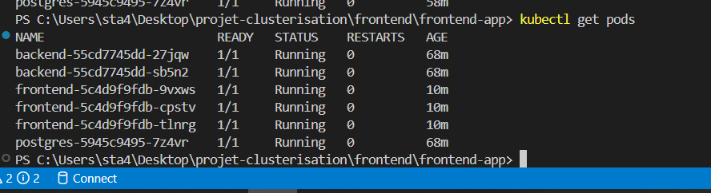
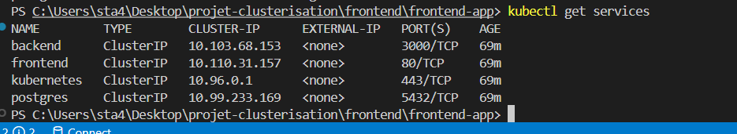
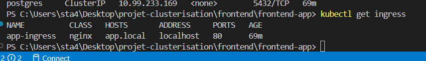
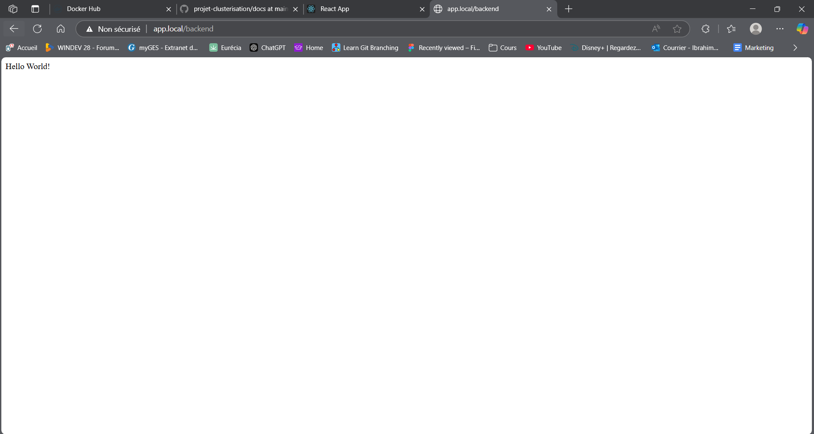
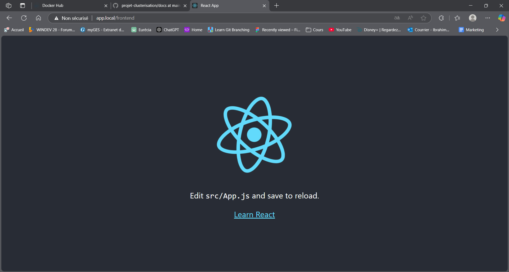
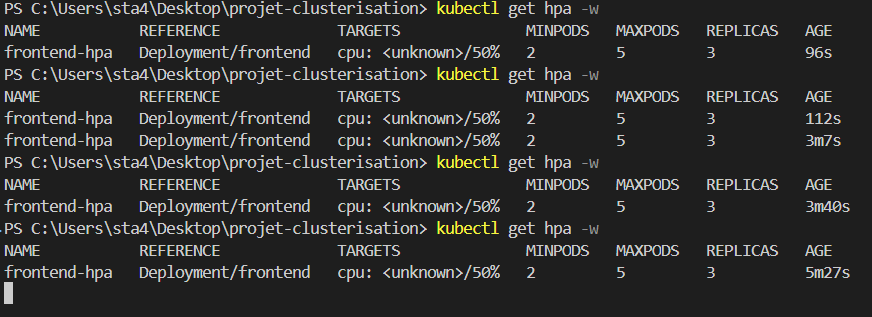
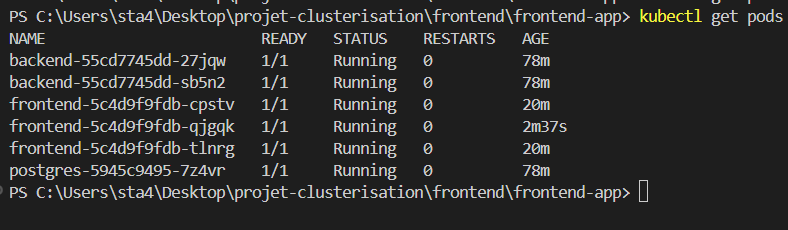
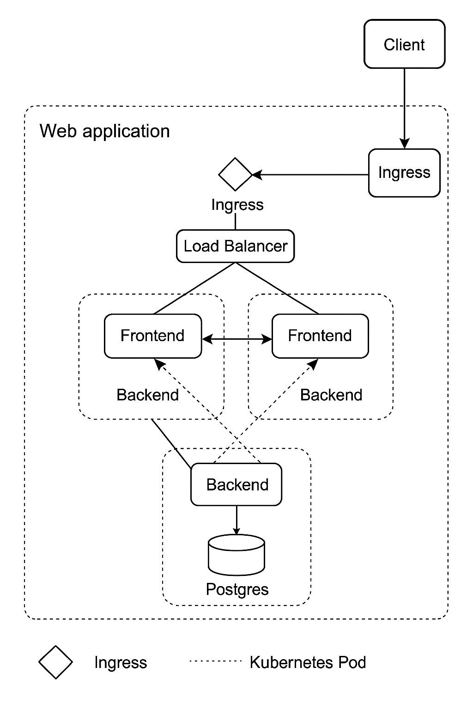

# Projet Clusterisation de Conteneurs  
OUAHABI Ibrahim 5IW3 ESGI Paris

## 📦 Objectif

Mettre en place une application conteneurisée et orchestrée avec :
- Backend : NestJS (TypeScript)
- Frontend : React (JavaScript)
- Base de données : PostgreSQL

Déployée sur un cluster Kubernetes pour démontrer :
✅ Haute disponibilité  
✅ Persistance des données  
✅ Sécurité (Secrets)  
✅ Exposition via Ingress

---

## 📁 Structure du projet

```
/backend/backend-app        → NestJS backend
/frontend/frontend-app      → React frontend
/k8s                       → Manifests Kubernetes (YAML)
```

---

## 🚀 Étapes d’installation

### 1️⃣ Démarrer Kubernetes avec Docker Desktop

- Active Kubernetes dans Docker Desktop
- Vérifie :
```bash
kubectl cluster-info
kubectl get nodes
```

---

### 2️⃣ Construire et pousser les images Docker

Backend :
```bash
cd backend/backend-app
docker build -t iouahabi/backend:latest .
docker push iouahabi/backend:latest
```

Frontend :
```bash
cd frontend/frontend-app
docker build -t iouahabi/frontend:latest .
docker push iouahabi/frontend:latest
```

---

### 3️⃣ Configurer le fichier hosts

Ajoute à la fin de `C:\Windows\System32\drivers\etc\hosts` :
```
127.0.0.1 app.local
```

---

### 4️⃣ Déployer Kubernetes

```bash
kubectl apply -f k8s/secrets.yaml
kubectl apply -f k8s/postgres.yaml
kubectl apply -f k8s/backend.yaml
kubectl apply -f k8s/frontend.yaml
kubectl apply -f k8s/ingress.yaml
kubectl apply -f k8s/frontend-hpa.yaml  # Bonus HPA
```

---

### 5️⃣ Vérifier les déploiements

```bash
kubectl get pods
kubectl get services
kubectl get ingress
kubectl get hpa
```

---

### 6️⃣ Accéder à l’application

- Frontend → [http://app.local/frontend](http://app.local/frontend)  
- Backend → [http://app.local/backend](http://app.local/backend)

---

## 🔐 Sécurité

- Secrets stockés dans `k8s/secrets.yaml`
- Variables d’environnement injectées dans les pods

---

## 📊 Tests réalisés

- Suppression d’un pod frontend → Kubernetes recrée automatiquement le pod
- Scale up/down :
```bash
kubectl scale deployment frontend --replicas=5
kubectl scale deployment frontend --replicas=3
```
- Autoscaling (HPA) :
```bash
kubectl get hpa
```

---

## 📷 Captures

- `kubectl get pods` → 
- `kubectl get services` → 
- `kubectl get ingress` → 
- Backend → 
- Frontend → 
- HPA → 
- Test de résilience → 
- Schéma d’architecture → 

---

## ✅ Bonus réalisés

- Autoscaling horizontal (HPA)
- Installation de Metrics Server

---

## ✏ Conclusion

Ce projet démontre la capacité à déployer une application complète (frontend, backend, base de données) sur Kubernetes, avec haute disponibilité, ingress, secrets, et autoscaling.  
Merci pour votre attention !

---

## 💬 Auteur

- Docker Hub : iouahabi  
- GitHub : [Narutino10]
